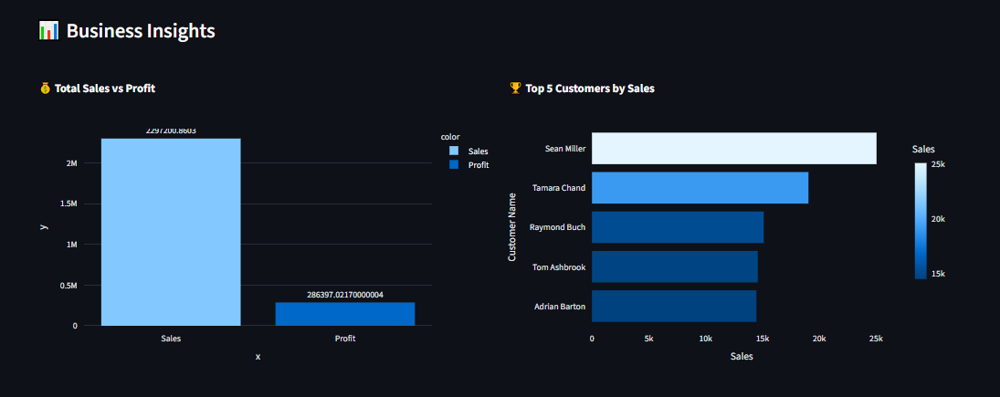
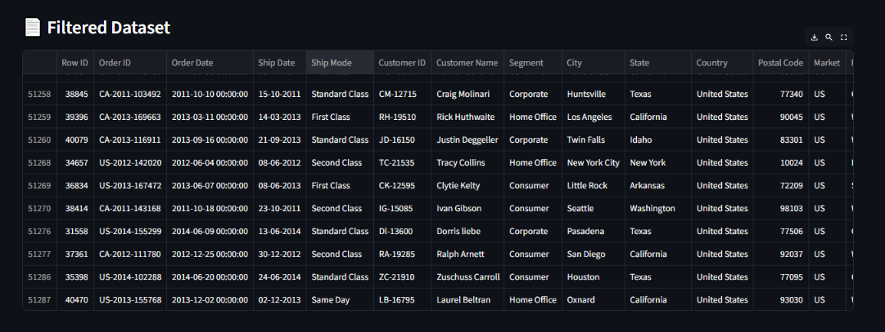
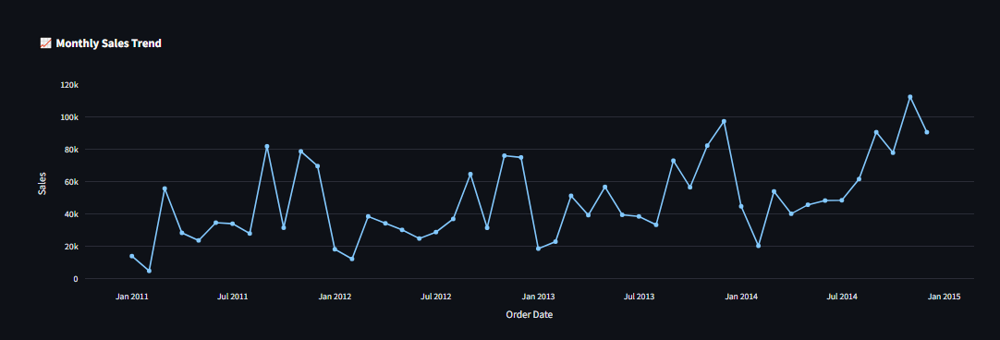

# 📊 Interactive Business Dashboard

### Streamlit + Plotly | Business Intelligence Analytics Dashboard


[](https://your-app-name.streamlit.app)


An interactive **Business Intelligence (BI) dashboard** built using **Streamlit**, **Pandas**, and **Plotly** to analyze sales, profit, and customer performance using the **Global Superstore Dataset**.

---

## 🚀 Project Overview

This dashboard helps users explore business data through interactive filters and visual analytics. It provides insights into:

* Sales performance
* Profit analysis
* Customer behavior
* Regional and category-wise breakdowns
* Monthly sales trends

---

## 🎯 Objective

To build an interactive dashboard that enables:

* Data cleaning and preprocessing
* Dynamic filtering (Region, Category, Sub-Category)
* KPI analysis (Sales, Profit, Orders)
* Data storytelling through visual charts

---

## 📂 Dataset

**Global Superstore Dataset**

Contains:

* Sales transactions
* Profit values
* Customer details
* Product categories
* Regions and segments

---

## ⚙️ Features

### 🔍 Interactive Filters

* Region-wise filtering
* Category filtering
* Sub-Category filtering
* Date range selection (advanced)

### 📊 Key Performance Indicators (KPIs)

* Total Sales 💰
* Total Profit 📈
* Total Orders 🧾
* Top Customers 🏆

### 📈 Visual Analytics

* Sales vs Profit comparison
* Top 5 customers by sales
* Sales distribution by region
* Profit by category
* Monthly sales trend analysis

---

## 🧠 Tech Stack

* Python 🐍
* Streamlit 🎈
* Pandas 📊
* Plotly 📈

---

## 📸 Dashboard Screenshots

### 📊 Business Insights Dashboard



### 🔍 Filtered Data View



### 📈 Monthly Sales Trend



---

## 🏗️ Project Structure

```
interactive-business-dashboard/
│
├── app.py
├── requirements.txt
├── data/
│   └── Global_Superstore.csv
├── src/
│   ├── data_loader.py
│   ├── preprocessing.py
│   ├── filters.py
│   ├── metrics.py
│   ├── charts.py
└── screenshots/
    ├── BusinessInsight.png
    ├── Filtered.png
    ├── Monthlysales.png
```

---

## ▶️ How to Run Locally

### 1. Clone the repository

```bash
git clone https://github.com/MuhammadShayan8401/interactive-business-dashboard.git
```

### 2. Install dependencies

```bash
pip install -r requirements.txt
```

### 3. Run the Streamlit app

```bash
streamlit run app.py
```

---

## 📊 Business Insights

This dashboard provides insights such as:

* Which regions generate the highest sales
* Which product categories are most profitable
* Top performing customers
* Monthly sales trends and seasonality

---

## 🎯 Skills Demonstrated

* Business Intelligence (BI) dashboard development
* Data visualization with Plotly
* Data preprocessing with Pandas
* Interactive UI development with Streamlit
* Data storytelling and analytics

---

## 🌐 Deployment

🚧 **Deployment Status:** Not deployed yet

Planned deployment options:

* Streamlit Community Cloud
* Render / HuggingFace Spaces
* Docker-based deployment

Live link will be added here once deployed:

👉 **Live Demo:[Live Streamlit App](https://muhammadshayan8401-interactive-business-dashboard-app-sj2opj.streamlit.app/)

---

## 👨‍💻 Author

**Muhammad Shayan Ahmed**
GitHub: [https://github.com/MuhammadShayan8401](https://github.com/MuhammadShayan8401)

---

## 📌 Future Improvements

* Add predictive analytics (sales forecasting)
* Add dark/light mode toggle
* Improve UI with advanced CSS styling
* Deploy live dashboard
* Add PDF report export feature
